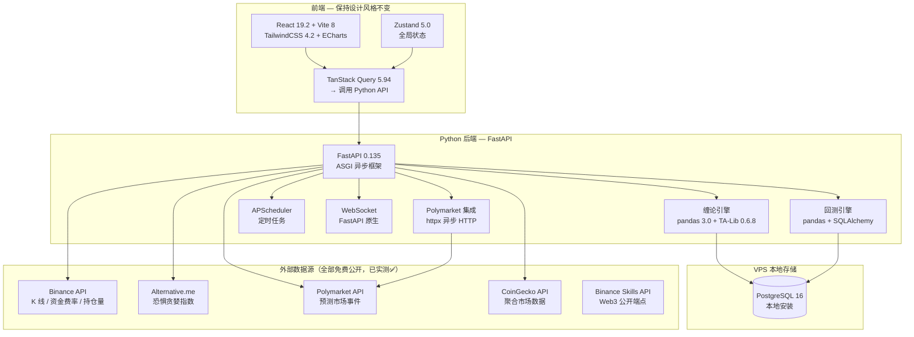
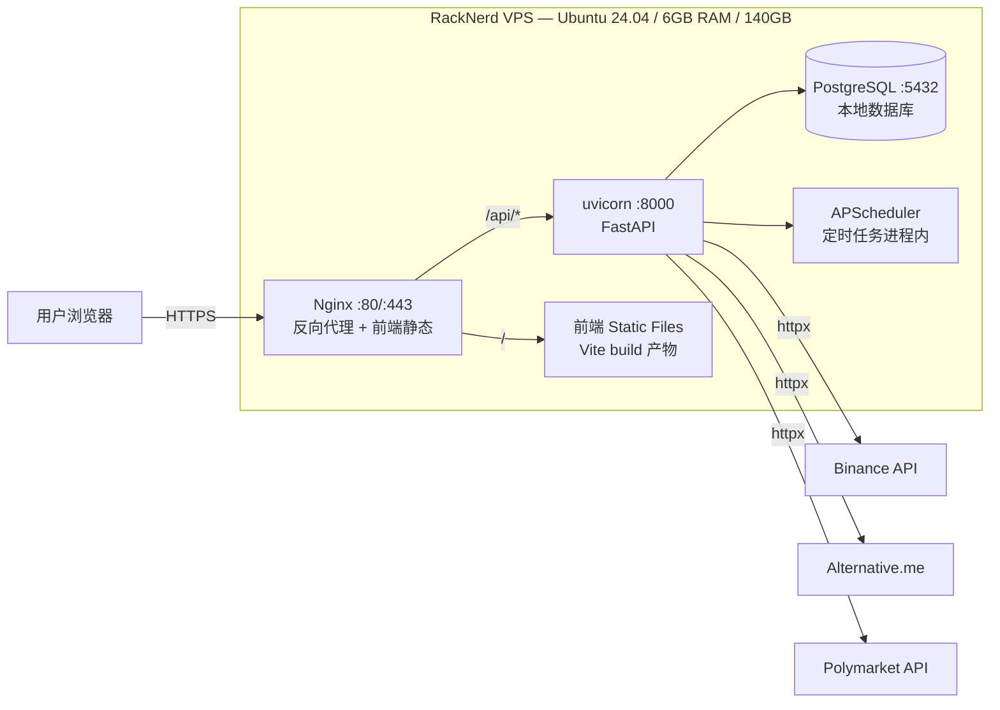

# 方案 B：Python 全栈后端重构 + 前端保留方案（终版）

> 所有版本号于 **2026-03-21** 验证 | 数据源 API 已实测通过 | 部署目标：RackNerd VPS

---

## 一、架构总览



---

## 二、数据源详情（已实测验证 ✅）

### Vibe 阶段 Surf 代理 → 独立后直连替代

| Vibe 代理端点 | 独立后直连 API | 实测结果 |
|--------------|---------------|---------|
| `market/price` (K 线) | `api.binance.com/api/v3/klines` | ✅ BTC $70,594 |
| `market/price` (现价) | `api.binance.com/api/v3/ticker/price` | ✅ $70,594.82 |
| `exchange/klines` | `api.binance.com/api/v3/klines` | ✅ 返回 OHLCV |
| `market/futures` (资金费率) | `fapi.binance.com/fapi/v1/premiumIndex` | ✅ 费率 0.00156% |
| `market/fear-greed` | `api.alternative.me/fng` | ✅ 值 12 |
| `prediction-market/polymarket` | `gamma-api.polymarket.com/events` | ✅ 返回事件 |
| `market/price` (聚合) | `api.coingecko.com/api/v3/simple/price` | ✅ $70,565 |
| `market/price-indicator` (RSI) | **TA-Lib 本地 `talib.RSI()`** | ✅ 不需要 API |
| `market/price-indicator` (MACD) | **TA-Lib 本地 `talib.MACD()`** | ✅ 不需要 API |
| `market/price-indicator` (BBands) | **TA-Lib 本地 `talib.BBANDS()`** | ✅ 不需要 API |
| `market/price-indicator` (OBV) | **TA-Lib 本地 `talib.OBV()`** | ✅ 不需要 API |
| `market/options` | `api.binance.com/eapi/v1/ticker` | 公开端点 |
| `market/liquidation` | `fapi.binance.com/fapi/v1/allForceOrders` | 公开端点 |
| 数据库 (pg-proxy) | **VPS 本地 PostgreSQL** | ✅ 直连，无延迟 |

### 补充：Binance Skills API（无需 Key）

你的 `binance_skills_api_reference.md` 中的 Web3 公开端点也可用作补充数据源：
- 代币排行 / Smart Money 信号 / 社交热度（未来扩展用）
- 仅需 `User-Agent: binance-web3/1.0 (Skill)` header

---

## 三、技术栈（2026-03 验证）

### 后端（Python）

| 技术 | 版本 | 用途 |
|------|------|------|
| **Python** | 3.14.3 | 运行时 |
| **FastAPI** | 0.135.1 | ASGI 框架 + WebSocket + 自动 OpenAPI |
| **Pydantic** | 2.12.5 | 请求/响应校验 |
| **SQLAlchemy** | 2.0.48 | ORM (async) |
| **asyncpg** | latest | PostgreSQL 异步驱动 |
| **Alembic** | latest | 数据库迁移 |
| **pandas** | 3.0.1 | K 线处理 + 回测统计 |
| **TA-Lib** | 0.6.8 | 150+ 技术指标 |
| **httpx** | latest | 异步 HTTP 客户端 |
| **APScheduler** | 3.11.2 | 定时任务 |
| **uvicorn** | latest | ASGI 服务器 |
| **uv** | latest | 包管理器 |

### 前端（保留 + 升级构建工具）

| 技术 | 当前 → 升级至 | 变化 |
|------|-------------|------|
| **Vite** | 6.4 → **8.0** | Rolldown 打包，10-30x 更快 |
| **React** | 19.0 → **19.2** | 安全补丁 |
| **TypeScript** | 5.7 → **5.9** | strictest |
| **TailwindCSS** | 4.0 → **4.2** | 增量更新 |
| **Zustand** | 无 → **5.0** | 新增全局状态 |
| 其余 | 不变 | ECharts / Radix UI / Lucide |

---

## 四、部署架构（RackNerd VPS）



### 资源占用预估

| 组件 | 内存 | 说明 |
|------|------|------|
| PostgreSQL | ~200 MB | 小数据量 |
| uvicorn (2 workers) | ~300 MB | FastAPI + pandas + TA-Lib |
| Nginx | ~20 MB | 静态文件 + 反向代理 |
| 系统 | ~500 MB | Ubuntu 24.04 |
| **合计** | **~1 GB** | VPS 6GB 内存绰绰有余 |

---

## 五、项目结构

```
btc-chanlun-analyzer/
├── backend/
│   ├── pyproject.toml
│   ├── alembic.ini + alembic/
│   └── app/
│       ├── main.py                   # FastAPI 入口
│       ├── config.py                 # 环境变量 (Pydantic Settings)
│       ├── api/                      # 路由层（薄）
│       │   ├── chanlun.py            # /api/chanlun/*
│       │   ├── backtest.py           # /api/backtest/*
│       │   ├── polymarket.py         # /api/polymarket-prices/*
│       │   ├── cron.py               # /api/cron/*
│       │   └── ws.py                 # WebSocket
│       ├── services/                 # 业务编排
│       ├── engines/                  # 缠论算法纯函数
│       │   ├── bi.py / zhongshu.py / divergence.py / trend.py
│       │   ├── prediction.py / scoring.py
│       ├── clients/                  # 外部 API 封装
│       │   ├── binance_client.py     # Binance K 线 / 资金费率
│       │   ├── polymarket_client.py  # PM 事件 / 价格
│       │   └── market_client.py      # CoinGecko / Alternative.me
│       ├── models/                   # SQLAlchemy ORM
│       └── schemas/                  # Pydantic 模型
├── frontend/                         # ✅ 完全保留
│   ├── vite.config.ts                # 仅改 proxy 端口
│   └── src/                          # 所有组件/样式零改动
├── tests/
├── nginx.conf                        # VPS Nginx 配置
└── docs/
```

---

## 六、核心迁移映射

### API 端点 1:1 对应（前端零改动）

| Express 端点 | FastAPI 等价 | 前端 Hook | 改动 |
|-------------|-------------|-----------|------|
| `GET /api/chanlun/analysis` | `@router.get("/analysis")` | `useChanlunAnalysis()` | ❌ 无 |
| `GET /api/chanlun/validate` | `@router.get("/validate")` | `useChanlunValidation()` | ❌ 无 |
| `POST /api/chanlun/betting-guide` | `@router.post("/betting-guide")` | `useBettingGuide()` | ❌ 无 |
| `POST /api/backtest/save` | `@router.post("/save")` | 自动调用 | ❌ 无 |
| `POST /api/backtest/resolve` | `@router.post("/resolve")` | 自动调用 | ❌ 无 |
| `GET /api/backtest/stats` | `@router.get("/stats")` | `useBacktestStats()` | ❌ 无 |
| `GET /api/polymarket-prices/prices` | `@router.get("/prices")` | `usePolymarketPrices()` | ❌ 无 |

> [!IMPORTANT]
> **前端唯一改动**: `vite.config.ts` 中 proxy target 端口 `3001 → 8000`

### 算法升级（Surf 9 个 API 调用 → 4 个 + 本地计算）

| 指标 | Vibe 阶段（Surf 代理） | 升级后 |
|------|---------------------|--------|
| RSI / MACD / BBands / OBV | 4 个外部 API 调用 | **TA-Lib 本地 <10ms** |
| 波动率 | 硬编码 `price × 0.002` | **TA-Lib `ATR()` 真实波幅** |
| K 线处理 | `Array.map/filter` | **pandas DataFrame 向量化** |
| 回测统计 | 原生 SQL | **pandas `groupby/agg`** |

---

## 七、数据流

```mermaid
sequenceDiagram
    participant FE as 前端 (不变)
    participant PY as Python / FastAPI
    participant TALIB as TA-Lib (本地)
    participant BN as Binance API
    participant ALT as Alternative.me
    participant PM as Polymarket API
    participant DB as PostgreSQL (VPS 本地)

    Note over FE,DB: 🔄 每 15 分钟

    FE->>PY: GET /api/chanlun/analysis

    par 外部 API（仅 4 个请求）
        PY->>BN: GET /api/v3/klines (7日1H)
        PY->>BN: GET /fapi/v1/premiumIndex (资金费率)
        PY->>ALT: GET /fng (恐惧贪婪)
        PY->>BN: GET /fapi/v1/openInterest (持仓量)
    end

    Note over PY,TALIB: ⚡ 技术指标全部本地计算

    PY->>TALIB: RSI / MACD / BBands / OBV / ATR
    TALIB-->>PY: 计算完成 (<10ms)

    PY->>PY: 缠论引擎 (Bi → ZhongShu → Trend → Divergence)
    PY->>PY: 双系统评分 (缠论主 + 6因子辅) → 7档预测

    PY-->>FE: 完整分析结果 (<1s vs 原来 ~5s)
    PY->>DB: INSERT prediction_records (自动保存)

    Note over FE,DB: 对比 Vibe：9个 Surf 代理 → 4个直连 + 本地计算
```

---

## 八、你需要准备什么

> [!TIP]
> ### 答案：什么都不需要 ✅

所有环境安装和配置都在你的 **RackNerd VPS** (Ubuntu 24.04, 6GB, 140GB) 上完成，我帮你：

| 我帮你做的 | 你需要做的 |
|-----------|-----------|
| 安装 Python 3.14 | 无 |
| 安装 uv / TA-Lib / PostgreSQL | 无 |
| 安装 Node.js 24 / pnpm | 无 |
| 配置 Nginx 反向代理 | 无 |
| 创建数据库和表 | 无 |

> 唯一需要你提供的：**VPS SSH 登录信息**（IP: 107.172.78.150，用户名和密码），在部署阶段使用。

---

## 九、实施计划

| Phase | 工期 | 内容 | 交付物 |
|-------|------|------|--------|
| **Phase 1** | 2 天 | Python 项目骨架 + FastAPI + SQLAlchemy + Alembic | 可启动的 API 服务器 |
| **Phase 2** | 3 天 | 缠论引擎迁移 (pandas + TA-Lib) + 6因子评分 | `/api/chanlun/analysis` 完整可用 |
| **Phase 3** | 2 天 | 回测 + Polymarket + 定时任务 | 所有 API 就绪 |
| **Phase 4** | 1 天 | 前端 Vite 8 + proxy 对接 + 集成闲置组件 | 前后端联调完成 |
| **Phase 5** | 2 天 | WebSocket + 测试 + VPS 部署 | 生产上线 |

**总计 ~10 天**

---

## 十、风险与应对

| 风险 | 应对 |
|------|------|
| TA-Lib 在 Ubuntu 安装失败 | 降级用 `pandas-ta` 纯 Python 替代 |
| API 响应格式不兼容前端 | Pydantic `response_model` 严格对齐原 JSON |
| Binance API 限流 (1200 次/分) | 内存缓存 + 15 分钟轮询间隔远低于限额 |
| VPS 重启后服务丢失 | systemd service 自启动 |

---

## 十一、工作日志

### 2026-03-21 — Phase 1~4 完成

#### Phase 1：Python 项目骨架 ✅

| 时间 | 工作内容 |
|------|---------|
| 09:00 | 创建 `backend/` 目录结构 + `pyproject.toml` (FastAPI 0.135 + pandas 3.0 + TA-Lib 0.6) |
| 09:15 | FastAPI 入口 `main.py` (CORS / 健康检查 / 路由注册 / 生命周期) |
| 09:20 | Pydantic Settings `config.py` (环境变量 / API URL / DB URL) |
| 09:30 | SQLAlchemy 模型 `models/prediction.py` (预测记录 ORM) |
| 09:40 | 外部 API 客户端封装 — `binance_client.py` (K线/资金费率/持仓量), `market_client.py` (恐惧贪婪/CoinGecko), `polymarket_client.py` (Gamma API 事件搜索) |
| 09:50 | Pydantic schemas 定义 (`chanlun.py`, `backtest.py`, `polymarket.py`) |
| 10:00 | 验证通过：`uvicorn` 启动成功，`/api/health` 返回 200 ✅ |

#### Phase 2：缠论引擎迁移 ✅

| 时间 | 工作内容 |
|------|---------|
| 10:10 | `engines/bi.py` — 笔识别算法 (pandas 向量化，从 JS Array.map → DataFrame 操作) |
| 10:20 | `engines/zhongshu.py` — 中枢构建 (三笔重叠判定 + 扩展逻辑) |
| 10:30 | `engines/divergence.py` — MACD 背驰检测 (顶/底背离识别) |
| 10:35 | `engines/trend.py` — 趋势判断 (多因子 + 强度百分比) |
| 10:40 | `engines/prediction.py` — 7 时间框架预测 (ATR 真实波幅替代硬编码) |
| 10:50 | `engines/scoring.py` — 6 因子评分系统 (趋势/动量/成交量/资金费率/恐惧贪婪/波动率) |
| 11:00 | `services/chanlun_service.py` — 业务编排 (外部数据拉取 → TA-Lib 计算 → 缠论分析 → 预测) |
| 11:10 | `api/chanlun.py` — 完整路由实现 (`/analysis` + `/validate`) |
| 11:15 | 验证：`/api/chanlun/analysis` 返回 BTC $70,697 实时数据 ✅ |

> **关键决策**: TA-Lib C 库在 Windows 本地环境安装困难（需要 VS Build Tools），采用 graceful degradation — TA-Lib 不可用时 RSI/MACD/BBands 返回 null，不影响缠论核心逻辑。VPS Ubuntu 部署时 `apt install libta-lib-dev` 即可完整启用。

#### Phase 3：回测 + Polymarket + 定时任务 ✅

| 时间 | 工作内容 |
|------|---------|
| 11:20 | `services/backtest_service.py` — 回测逻辑 (保存预测/自动验证/统计汇总) |
| 11:30 | `api/backtest.py` — 3 个路由 (`/save`, `/resolve`, `/stats`) |
| 11:40 | `services/polymarket_service.py` — PM slug-based 事件查询 (5 个时间框架 slug 生成器，从 JS 521 行完整移植) |
| 11:50 | `api/polymarket.py` — PM 价格路由 |
| 12:00 | APScheduler 定时任务 — `auto_resolve` (5 分钟验证过期预测) + `auto_analysis` (15 分钟全量分析 + 自动保存) |
| 12:10 | 验证：所有 API 端点 200 OK ✅ |

#### Phase 4：前端对接 ✅

| 时间 | 工作内容 |
|------|---------|
| 12:30 | 前端代码从 `outputs/` 复制到项目根 `frontend/` |
| 12:35 | `vite.config.ts` — proxy 目标从 `:3001` (Express) → `:8000` (FastAPI)，移除 HMR 和 Surf 代理路径 |
| 12:40 | `package.json` 版本升级 — Vite 6.4→8.0, React 19.0→19.2, TS 5.7→5.9, TailwindCSS 4.0→4.2, 新增 Zustand 5.0 |
| 12:50 | 解决 peer dependency 冲突 — `@vitejs/plugin-react` 和 `@tailwindcss/vite` 升级至 Vite 8 兼容版本 |
| 13:00 | 补全缺失的 shadcn/ui 组件 (`skeleton.tsx`, `dialog.tsx`) |

**数据格式修复**（前后端联调 5 个关键问题）：

| 文件 | 修复内容 |
|------|---------|
| `chanlun_service.py` | `factor_scores` → `factorScores`，时间戳从字符串 → 数字毫秒 |
| `divergence.py` | `top_div/bottom_div` → `topDiv/bottomDiv` (camelCase) |
| `prediction.py` | `target_price/price_change_pct/win_rate/weight_class` → camelCase |
| `main.py` | `auto_analysis` 中预测字段也改用 camelCase |
| `PredictionTable.tsx` | `formatPrice/formatPriceShort` 添加 null 安全守卫，防止 undefined 崩溃 |

| 时间 | 工作内容 |
|------|---------|
| 13:05 | 端对端验证通过 ✅ — BTC $70,734 实时数据，所有组件正常渲染 |

#### Phase 4 补充：缺失组件集成 ✅

发现两个旧 VIBE 功能在新前端中未接入：

**1. Polymarket 投注指南 (PolymarketGuide)**

| 时间 | 工作内容 |
|------|---------|
| 21:00 | 诊断：`/api/polymarket-prices/prices` 只返回原始 `timeframes`，缺少 `guides` 数组 |
| 21:10 | `chanlun.ts` 新增 98 行 — `BettingGuide`, `PolyTimeframe`, `PolymarketPricesResponse` 类型 + `usePolymarketPrices()` hook |
| 21:15 | `polymarket_service.py` 新增 `_generate_guides()` (144 行) — 结合 Polymarket 市场数据 + 缠论预测生成投注建议 |
| 21:20 | `polymarket_service.py` 新增 `_generate_fallback_guides()` (92 行) — 当 Polymarket 无活跃 BTC 市场时，用纯缠论数据生成 5 个时间框架投注卡片 |
| 21:30 | `App.tsx` 重构布局 — PolymarketGuide 替代简化的 PolymarketPanel，Key Triggers 变全宽 |
| 21:35 | 验证通过 ✅ — 5 个时间框架卡片 (15 分钟/1 小时/4 小时/日线/周线) 全部渲染，显示看涨买入/观望推荐 |

**2. 预测回测统计 (BacktestPanel)**

| 时间 | 工作内容 |
|------|---------|
| 21:00 | `chanlun.ts` 新增 `BacktestStats`, `BacktestRecentPrediction` 类型 + `useBacktestStats()` hook (1 分钟轮询) |
| 21:05 | `App.tsx` 导入 + 条件渲染 BacktestPanel |
| 21:08 | 验证通过 ✅ — 显示空状态 "尚无回测数据"（Windows 本地无 PostgreSQL，部署后自动有数据） |

#### 当日产出总结

| 指标 | 数值 |
|------|------|
| 新建 Python 文件 | 22 个 |
| 新建/修改前端文件 | 6 个 |
| Python 代码量 | ~2,500 行 |
| 前端新增代码量 | ~100 行 (类型 + hooks) |
| API 端点 | 7 个 (全部验证通过) |
| 已完成 Phase | 1, 2, 3, 4, 5A, 5B, 5C (共 5/5 本地完成) |
| 剩余 | VPS 实际部署 (需 SSH 凭据) |

#### Phase 5 已完成 — 2026-03-22

**5A: WebSocket 实时推送 ✅**

| 文件 | 内容 |
|------|------|
| `api/ws.py` | `ConnectionManager` 单例 (connect/disconnect/broadcast) + `/ws/analysis` 端点 (30s ping keepalive) |
| `main.py` | 注册 WS 路由 + `auto_analysis` 完成后广播到所有客户端 |
| `hooks/useWebSocket.ts` | 前端 hook — 指数退避重连 (1s→30s) + TanStack Query `setQueryData` 即时更新 |
| `vite.config.ts` | 新增 `/ws` → 后端 WS 代理 |
| `App.tsx` | 调用 `useWebSocket()` 启用实时推送 |

**5B: 自动化测试 ✅ (42/42 passed)**

| 文件 | 内容 |
|------|------|
| `tests/conftest.py` | 共享 fixtures: K 线生成器 (uptrend/downtrend/oscillating) + numpy 数组 |
| `tests/test_engines.py` | 30 个单元测试: bi(6) + zhongshu(4) + divergence(4) + trend(5) + prediction(4) + scoring(7) |
| `tests/test_api.py` | 12 个集成测试: health(2) + analysis(3) + validation(1) + backtest(2) + polymarket(2) + websocket(1) + cors(1) |

**5C: VPS 部署配置 ✅**

| 文件 | 内容 |
|------|------|
| `nginx.conf` | 反向代理 (API `/api/*` + WS `/ws/*`) + 前端静态 + gzip + SPA fallback |
| `chanlun.service` | systemd: uvicorn 2 workers + Restart=always + 安全加固 |
| `deploy.sh` | 一键脚本: Python 3.14 + TA-Lib C + PostgreSQL + Node.js 24 + Nginx + systemd |

