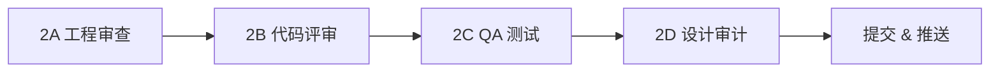

# P2 — 质量保障与工程成熟度升级

> 基于 Garry Tan (YC 总裁) 的 [gstack](https://github.com/garrytan/gstack) 工作流设计
> 目标：从"快速原型"过渡到"生产级系统"

---

## 背景

P1 阶段（缠论引擎 + Polymarket 集成 + 前端）已完成快速迭代，功能基本完备。但存在以下问题：

| 问题 | 风险等级 | 来源 |
|------|---------|------|
| 无错误边界映射 — API 超时/返回异常时静默失败 | 🔴 高 | gstack #02 错误与救援映射 |
| 无测试覆盖审计 — 42 个测试(2 文件: `test_engines.py` + `test_api.py`)但覆盖面不清 | 🔴 高 | gstack #11 测试覆盖审计 |
| 前端零 QA 测试 — 从未系统性地测试每个交互 | 🟡 中 | gstack #09 QA 工程师 |
| UI 可能存在设计不一致 — 快速迭代中累积的视觉债务 | 🟡 中 | gstack #08 设计审计 |
| 无可观测性 — 生产环境无日志/指标/告警 | 🟡 中 | gstack #02 第 8 部分 |
| 无发布流程 — 手动 git push + SSH 部署 | 🟢 低 | gstack #11 发布工程师 |

---

## GStack 技能分析 — 适用于 BTC-PM 的 8 个工作流

### 🔵 直接适用（P2 核心）

| # | GStack Skill | 我们怎么用 | 优先级 |
|---|-------------|-----------|--------|
| 1 | `/plan-eng-review` 工程经理评审 | 对后端做 11 部分全面审查 — 架构/错误映射/安全/测试/性能 | P0 |
| 2 | `/review` 上线前代码评审 | 对所有代码做 6 点结构性检查 — SQL 安全/错误处理/死代码 | P0 |
| 3 | `/qa` QA 工程师 | 用浏览器系统测试前端每个页面/交互/边界情况 | P1 |
| 4 | `/design-review` 设计审计 | 视觉一致性审计 — 间距/字体/颜色/暗色模式/响应式 | P1 |
| 5 | `/investigate` 系统化调试 | 建立调试 SOP — 四阶段流程（调查→分析→假设→实施） | P2 |

### 🟢 后续采用

| # | GStack Skill | 我们怎么用 | 阶段 |
|---|-------------|-----------|------|
| 6 | `/ship` 发布工程师 | 自动化发布流水线 — 测试→版本号→变更日志→推送 | P3 |
| 7 | `/retro` 周回顾 | 每周回顾提交历史/热点文件/代码质量趋势 | 持续 |
| 8 | `/plan-ceo-review` CEO 评审 | 大版本前的战略级审查 | 按需 |

### ⚪ 不适用

| # | GStack Skill | 原因 |
|---|-------------|------|
| `/office-hours` | 面向 YC 创业公司，不适用单人项目 |
| `/plan-design-review` | 方案阶段用，我们已在执行阶段 |
| `/qa-only` | 我们需要发现+修复，不需要纯报告 |
| `/freeze` `/unfreeze` `/guard` | 多人协作用，单人项目不需要 |
| `/careful` | 安全护栏，当前无高风险操作 |
| `/browse` `/setup-browser-cookies` | 工具型，非流程型 |

---

## P2 执行计划

### Phase 2A — 工程审查（`/plan-eng-review` 风格）

**目标：** 建立错误与救援注册表 + 数据流暗影路径分析

#### 2A-1. 错误与救援映射
对每个外部 API 调用建立完整映射表：

```
方法/代码路径                          | 可能出什么错        | 异常类
binance_client.BinanceClient.get_klines | API 超时           | httpx.TimeoutError
                                       | API 429 限流       | httpx.HTTPStatusError
                                       | 返回畸形 JSON      | json.JSONDecodeError
                                       | 美国 IP 被封       | httpx.HTTPStatusError(451)
polymarket_client.PolymarketClient.fetch| API 不可达         | httpx.ConnectError
                                       | 返回空数据         | (无异常, 但数据为空)
market_client.MarketClient.get_fear_greed| API 超时          | httpx.TimeoutError
market_client.MarketClient.get_btc_price_coingecko | 限流 (30/min) | httpx.HTTPStatusError(429)
```

```
异常类                    | 是否救援？| 救援操作           | 用户看到什么
httpx.TimeoutError       | 是      | 重试 2 次 + 退避    | "数据加载中..."
httpx.HTTPStatusError(429)| 是     | 退避 60s + 重试     | 使用缓存数据
httpx.ConnectError       | 是      | 使用缓存/降级       | "离线模式"
json.JSONDecodeError     | 否 ← 缺口| —                 | 500 错误 ← 差
```

**产出：** `docs/ERROR_REGISTRY.md`

#### 2A-2. 数据流暗影路径分析

```
Binance K线 ──▶ 缠论引擎 ──▶ 预测 ──▶ Polymarket 指南 ──▶ 前端
  │               │            │            │               │
  ▼               ▼            ▼            ▼               ▼
[超时?]        [空数据?]    [NaN?]      [无市场?]        [WS断开?]
[封IP?]        [K线不足?]  [零胜率?]   [API变更?]       [数据过期?]
[限流?]        [异常值?]   [全0?]      [格式变化?]      [渲染崩溃?]
```

**产出：** 每条暗影路径的处理方案

#### 2A-3. 测试覆盖审计

```
变更的文件/模块                    | 对应测试                          | 覆盖状态
engines/bi.py                     | test_engines.py::TestFindBi       | ✅ 已覆盖
engines/zhongshu.py               | test_engines.py::TestCreateZhongshu| ✅ 已覆盖
engines/divergence.py             | test_engines.py (divergence_bias)  | ✅ 已覆盖
engines/trend.py                  | test_engines.py::TestAnalyzeTrend  | ✅ 已覆盖
engines/prediction.py             | test_engines.py::TestGeneratePredictions | ✅ 已覆盖
engines/scoring.py                | test_engines.py::TestScoring       | ✅ 已覆盖
services/chanlun_service.py       | (间接通过 test_api)               | ⚠️ 间接
services/polymarket_service.py    | (无直接测试)                      | ⚠️ 未覆盖
services/backtest_service.py      | (无直接测试)                      | ⚠️ 未覆盖
clients/binance_client.py         | (无)                              | ❌ 未覆盖
clients/polymarket_client.py      | (无)                              | ❌ 未覆盖
clients/market_client.py          | (无)                              | ❌ 未覆盖
api/chanlun.py + backtest.py + polymarket.py | test_api.py            | ✅ 已覆盖
api/ws.py (WebSocket)             | (无)                              | ❌ 未覆盖
api/cron.py (定时任务)             | (无)                              | ❌ 未覆盖
frontend/ (15个组件)              | (无前端测试框架)                   | ❌ 无测试
```

**产出：** 补充缺失的测试用例

---

### Phase 2B — 代码评审（`/review` 风格）

**6 点结构性检查：**

- [ ] **3.1 SQL 安全** — 检查 SQLAlchemy 查询是否有原始 SQL 拼接
- [ ] **3.2 错误处理** — 清除万能 `catch Exception`，每个异常有名字
- [ ] **3.3 条件性副作用** — WebSocket 广播/定时任务中的竞态条件
- [ ] **3.5 安全** — 硬编码密钥扫描（已在 GitHub push 前完成 ✅）
- [ ] **3.6 死代码** — 注释掉的代码、未使用的导入、陈旧注释
- [ ] **3.7 输入验证** — API 端点的请求参数验证（Pydantic schema）

**产出：** 原子提交修复每个问题

---

### Phase 2C — QA 测试（`/qa` 风格）

**Standard 等级（默认），测试所有页面：**

| 页面/组件 | 测试项 |
|----------|--------|
| 市场概览卡片 | BTC 价格/趋势/RSI/恐贪指数/资金费率/持仓量显示正确 |
| K 线图 | 缠论笔/中枢叠加层正确渲染 |
| 预测图 | 目标价/支撑/阻力线正确 |
| 胜率图 | 柱状图数据与预测表一致 |
| 多时间框架预测表 | 7 个时间档全部显示，PM 列有数据 |
| Polymarket 投注指南 | 4 个时间档卡片，缠论概率+辅助胜率inline |
| Key Triggers | 触发条件正确显示 |
| 回测面板 | 历史预测准确率统计 |
| WebSocket | 自动重连、实时推送验证 |
| 暗色/亮色模式 | 切换后所有组件正确渲染 |
| 自动刷新 | 倒计时 + 手动刷新按钮 |

**QA 健康评分公式：**
```
控制台错误    15%
链接完整性    10%
视觉一致性    15%
功能正确性    25%
用户体验      15%
性能          10%
内容质量       5%
可访问性       5%
```

**产出：** `docs/QA_REPORT.md` （健康评分 X/100）

---

### Phase 2D — 设计审计（`/design-review` 风格）

**Quick 模式，检查关键页面：**

- [ ] 容器宽度/间距一致性
- [ ] 字号层级清晰（h1 > h2 > body > caption）
- [ ] 暗色模式色彩正确
- [ ] 按钮/卡片/图标风格统一
- [ ] 加载状态有骨架屏
- [ ] 空状态有引导内容
- [ ] 错误状态有具体信息（不是通用 "Error"）

**产出：** 原子提交修复每个设计问题

---

## 执行顺序



| 阶段 | 预计工时 | 关键产出 |
|------|---------|---------|
| 2A 工程审查 | 2-3h | ERROR_REGISTRY.md + 暗影路径修复 + 测试补充 |
| 2B 代码评审 | 1-2h | 6 点检查 + 原子提交修复 |
| 2C QA 测试 | 1-2h | QA_REPORT.md (健康评分) |
| 2D 设计审计 | 1h | 视觉一致性修复 |
| **总计** | **5-8h** | **生产级质量保障** |

---

## 不在 P2 范围

- ❌ VPS 部署调试（Binance 美国 IP 封锁问题 → P3）
- ❌ 自动化发布流水线（`/ship` → P3）
- ❌ 周回顾系统（`/retro` → 持续）
- ❌ 新功能开发
- ❌ 性能优化（除非 QA 发现严重问题）
