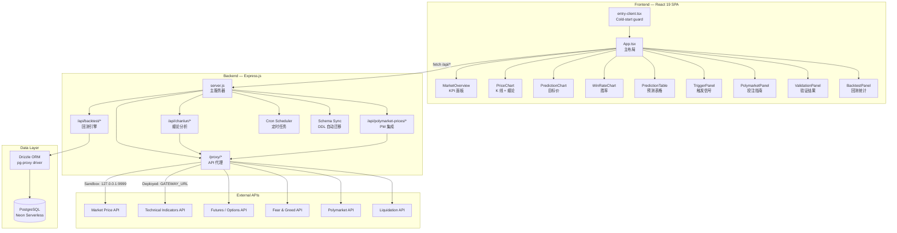
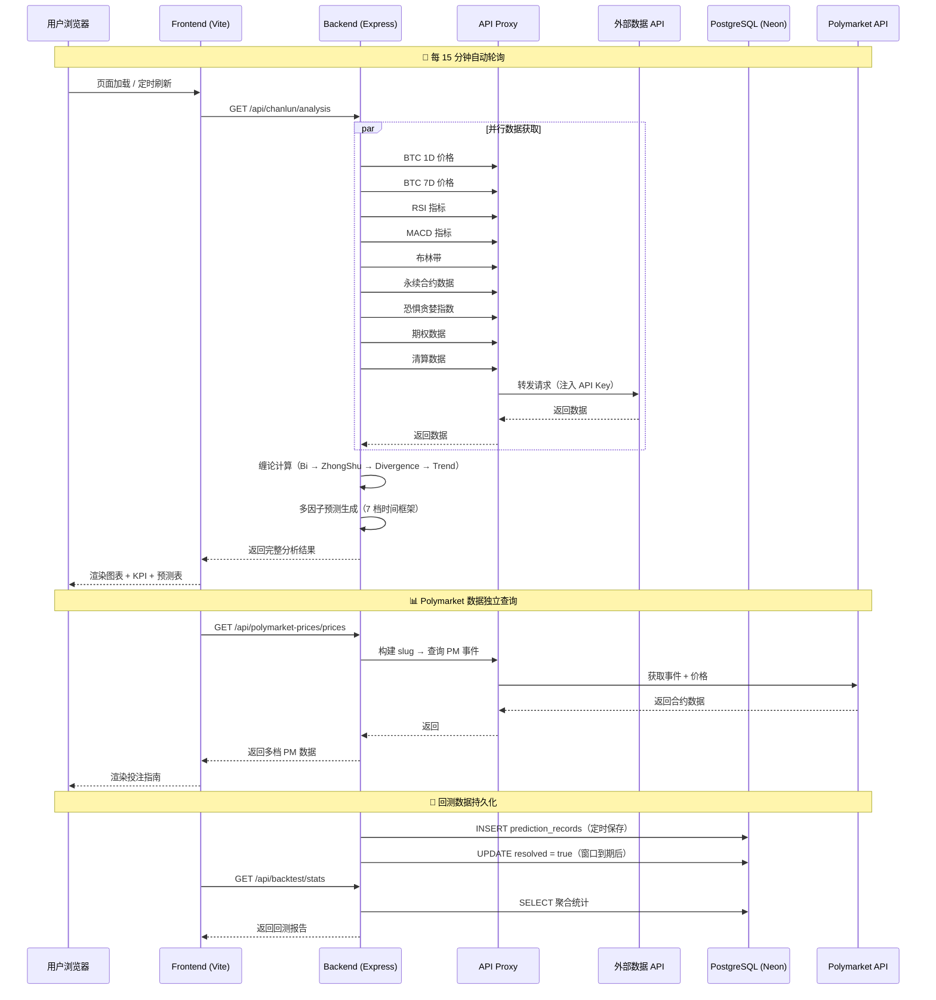
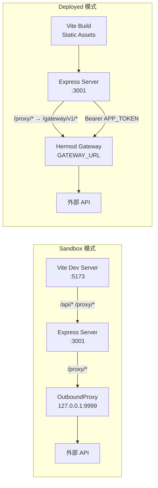
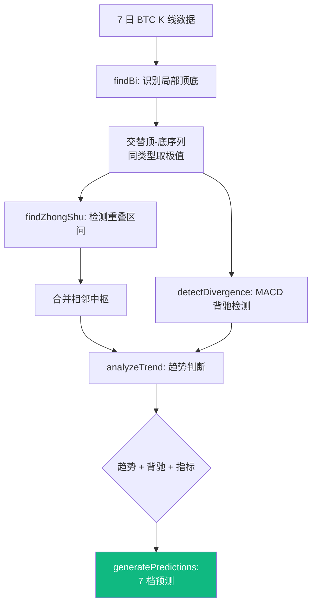

# BTC Chanlun Analyzer — 产品需求文档 (PRD)

> **项目名称**: BTC Chanlun Analyzer + Polymarket Betting Guide
> **版本**: v1.0 &nbsp;|&nbsp; **日期**: 2026-03-21
> **项目路径**: `d:\AI_Projects\project (2)\outputs\20260320_033752\`

---

## 一、产品概述

### 1.1 产品定位

**BTC Chanlun Analyzer** 是一款基于**缠论（Chan Theory）**技术分析框架的 BTC（比特币）实时行情分析与预测系统，同时整合了 **Polymarket 预测市场**的赔率数据，为用户提供缠论驱动的投注决策指导。

### 1.2 核心价值主张

| 维度 | 描述 |
|------|------|
| **量化分析** | 基于缠论的笔（Bi）、段（Duan）、中枢（ZhongShu）自动化识别，结合 MACD 背驰检测 |
| **多因子预测** | 融合 RSI、布林带、资金费率、恐惧贪婪指数、MACD 背驰等多因子生成 7 档时间框架预测 |
| **预测市场套利** | 自动拉取 Polymarket BTC 相关合约（15M/1H/4H/Daily/Weekly），结合缠论趋势给出 BUY YES / BUY NO / WAIT 建议 |
| **回测验证** | 自动记录每 15 分钟的预测并在时间窗口到期后回测，计算方向命中率与价格误差 |

### 1.3 目标用户

- **加密货币交易者** — 需要专业技术分析辅助的短线/中线交易者
- **Polymarket 玩家** — 在预测市场上对 BTC 价格走向下注的用户
- **量化研究人员** — 关注缠论算法在加密市场应用效果的研究者

---

## 二、功能需求

### 2.1 核心功能模块

#### 🔬 模块 A：缠论分析引擎（Chanlun Engine）

| 功能 | 说明 | 实现文件 |
|------|------|----------|
| **笔（Bi）识别** | 从 K 线数据中自动识别局部顶底，构建交替的顶-底序列 | [chanlun.js](file:///d:/AI_Projects/project%20(2)/outputs/20260320_033752/backend/routes/chanlun.js) |
| **中枢（ZhongShu）构建** | 从笔序列中检测至少 3 笔重叠区域，合并相邻中枢 | 同上 |
| **背驰检测** | 价格创新高/新低但 MACD 柱状体未同步 → 顶底背驰信号 | 同上 |
| **趋势判断** | 基于最新笔类型 + 价格相对中枢位置，输出 bullish/bearish/consolidating/neutral | 同上 |
| **多时间框架预测** | 生成 30m/1h/2h/4h/8h/12h/24h 共 7 档预测（方向 + 目标价 + 胜率 + 支撑阻力） | 同上 |

**数据依赖（并行获取）**：
- BTC 1 日 / 7 日价格数据
- RSI（1H）、MACD（1H，7 日）、布林带（1H）
- 永续合约资金费率、持仓量、多空比
- 恐惧贪婪指数
- 期权数据
- 清算数据

#### 📊 模块 B：回测引擎（Backtest Engine）

| 功能 | 说明 | 实现文件 |
|------|------|----------|
| **预测存储** | `POST /api/backtest/save` — 存储带时间窗口的预测记录（含 Polymarket 数据） | [backtest.js](file:///d:/AI_Projects/project%20(2)/outputs/20260320_033752/backend/routes/backtest.js) |
| **自动验证** | `POST /api/backtest/resolve` — 到期后获取实际价格，打分 EXACT/CLOSE/HIT/MISS | 同上 |
| **统计聚合** | `GET /api/backtest/stats` — 总命中率、按时间框架/方向聚合、日趋势、近期预测明细 | 同上 |

**评分标准**：

| 等级 | 条件 |
|------|------|
| **EXACT** | 方向正确 且 目标价误差 < 0.1% |
| **CLOSE** | 方向正确 且 目标价误差 < 0.3% |
| **HIT** | 方向正确 且 目标价误差 ≥ 0.3% |
| **MISS** | 方向错误 |

#### 🎰 模块 C：Polymarket 预测市场集成

| 功能 | 说明 | 实现文件 |
|------|------|----------|
| **多档时间窗口查询** | 支持 15M/1H/4H/Daily/Weekly 五个时间级别的 BTC 合约 | [polymarket-prices.js](file:///d:/AI_Projects/project%20(2)/outputs/20260320_033752/backend/routes/polymarket-prices.js) |
| **Slug 动态构建** | 根据当前 ET 时间自动构建 Polymarket 事件 slug，无需搜索 API | 同上 |
| **涨跌概率提取** | Up/Down 市场 → 提取 upProb / downProb | 同上 |
| **隐含价格计算** | Multi-Strike 市场 → 通过 strike 概率插值计算市场隐含 BTC 价格 | 同上 |
| **投注建议** | 结合缠论趋势输出 BUY YES / BUY NO / WAIT 信号 | [PolymarketPanel.tsx](file:///d:/AI_Projects/project%20(2)/outputs/20260320_033752/frontend/src/components/PolymarketPanel.tsx) |

### 2.2 前端页面结构

```
┌──────────────────────────────────────────────────┐
│  Header: BTC Chanlun Analyzer | 刷新计时器 | 主题切换  │
├──────────────────────────────────────────────────┤
│  MarketOverview: 6 格 KPI 面板                      │
│  [BTC 价格] [缠论趋势] [RSI] [恐惧贪婪] [资金费率] [持仓量]  │
├──────────────────────────────────────────────────┤
│  PriceChart: K 线图 + 缠论笔/中枢 overlay             │
├──────────────────────────────────────────────────┤
│  ┌────────────────┐  ┌────────────────┐          │
│  │ PredictionChart │  │  WinRateChart  │          │
│  │ (目标价柱状图)    │  │  (胜率柱状图)    │          │
│  └────────────────┘  └────────────────┘          │
├──────────────────────────────────────────────────┤
│  PredictionTable: 7 档预测详情表格                     │
├──────────────────────────────────────────────────┤
│  ┌────────────────┐  ┌──────────────────┐        │
│  │  TriggerPanel  │  │ PolymarketPanel  │        │
│  │  (触发信号面板)   │  │ (投注指南面板)      │        │
│  └────────────────┘  └──────────────────┘        │
├──────────────────────────────────────────────────┤
│  ValidationPanel: 上一轮预测验证结果                   │
├──────────────────────────────────────────────────┤
│  BacktestPanel: 历史回测统计                         │
├──────────────────────────────────────────────────┤
│  Disclaimer                                      │
└──────────────────────────────────────────────────┘
```

### 2.3 数据刷新策略

| 项目 | 刷新间隔 | 机制 |
|------|----------|------|
| 缠论分析 | 15 分钟 | TanStack Query `refetchInterval` |
| 预测验证 | 15 分钟 | 同上，依赖上一轮预测数据存在 |
| Polymarket 数据 | 按需 | 页面加载时查询，结合搜索 + 排名两个数据源 |

---

## 三、技术架构

### 3.1 整体架构图



### 3.2 技术栈详情

#### 前端技术栈

| 技术 | 版本 | 用途 |
|------|------|------|
| **React** | 19.0 | UI 框架 |
| **Vite** | 6.4 | 构建工具 + 开发服务器 |
| **TypeScript** | 5.7 | 类型安全 |
| **TailwindCSS** | 4.0 | 样式框架 |
| **ECharts** | 5.5 | 金融图表（K 线、柱状图） |
| **TanStack Query** | 5.62 | 服务端状态管理 + 自动轮询 |
| **Radix UI** | 各组件 v1.x-2.x | 无障碍 UI 原语（20+ 组件） |
| **Lucide React** | 0.454 | 图标库 |
| **next-themes** | 0.4 | 深色/浅色主题切换 |
| **XYFlow + dagre** | 12.4 / 0.8 | 流程图/节点图布局（已引入未使用） |
| **react-hook-form + zod** | 7.53 / 3.23 | 表单验证（已引入未使用） |

#### 后端技术栈

| 技术 | 版本/说明 | 用途 |
|------|-----------|------|
| **Node.js + Express** | — | HTTP 服务器 + REST API |
| **Drizzle ORM** | pg-proxy driver | PostgreSQL ORM，通过代理路由 SQL |
| **drizzle-kit** | API 模式 | DDL 自动生成与迁移 |
| **croner** | — | 定时任务调度（Cron 表达式） |
| **http-proxy-middleware** | — | API 反向代理（sandbox / deployed 双模式） |
| **PostgreSQL (Neon)** | Serverless | 持久化存储（预测记录） |

### 3.3 数据流架构



### 3.4 数据库 Schema

```sql
-- 表: prediction_records
-- 用途: 存储每 15 分钟的 BTC 价格预测及回测验证结果

CREATE TABLE prediction_records (
  id                SERIAL PRIMARY KEY,

  -- 预测参数
  prediction_time   TIMESTAMPTZ NOT NULL,       -- 预测发起时间
  timeframe         TEXT NOT NULL,               -- '30m','1h','2h','4h','8h','12h','24h'
  direction         TEXT NOT NULL,               -- 'up','down','sideways'
  target_price      REAL NOT NULL,               -- 预测目标价
  current_price     REAL NOT NULL,               -- 预测时 BTC 价格
  win_rate          INTEGER NOT NULL,            -- 模型置信度 (35-85)
  weight_class      TEXT,                        -- 权重级别 '1H','4H','1D'
  factor_scores     JSONB,                       -- 各因子得分明细

  -- Polymarket 关联数据
  pm_action         TEXT,                        -- 投注建议
  pm_above_prob     REAL,                        -- 缠论做多概率
  pm_base_price     REAL,                        -- PM 基准价
  pm_edge           REAL,                        -- 边际优势

  -- 验证结果（到期后填充）
  resolved            BOOLEAN DEFAULT false,
  resolve_target_time TIMESTAMPTZ,               -- 预测窗口到期时间
  actual_price        REAL,                      -- 实际到期价格
  direction_correct   BOOLEAN,                   -- 方向是否正确
  accuracy_grade      TEXT,                      -- 'EXACT','CLOSE','HIT','MISS'
  target_error_pct    REAL,                      -- 目标价误差百分比

  created_at          TIMESTAMPTZ DEFAULT NOW(),

  UNIQUE (prediction_time, timeframe)            -- 防止重复记录
);
```

### 3.5 API 接口清单

| 方法 | 路径 | 说明 |
|------|------|------|
| `GET` | `/api/health` | 健康检查 |
| `GET` | `/api/chanlun/analysis` | 获取完整缠论分析 + 预测 |
| `GET` | `/api/chanlun/validate?predictions=...` | 对比上轮预测与当前价格 |
| `POST` | `/api/backtest/save` | 保存一批预测记录 |
| `POST` | `/api/backtest/resolve` | 批量验证到期预测 |
| `GET` | `/api/backtest/stats` | 获取回测聚合统计 |
| `GET` | `/api/polymarket-prices/prices` | 获取多时间框架 PM 合约数据 |
| `GET` | `/api/cron` | 列出所有定时任务 |
| `POST` | `/api/cron` | 创建定时任务 |
| `PATCH` | `/api/cron/:id` | 更新定时任务 |
| `DELETE` | `/api/cron/:id` | 删除定时任务 |
| `POST` | `/api/cron/:id/run` | 手动触发任务 |
| `POST` | `/api/__sync-schema` | 手动触发数据库 schema 同步 |
| `*` | `/proxy/*` | API 反向代理（sandbox / deployed） |

### 3.6 部署架构



**关键设计**:
- **双模式代理**: Sandbox 环境走 OutboundProxy（本地 9999 端口），生产环境走 Hermod Gateway（Bearer Token 鉴权）
- **响应缓冲**: 使用 `selfHandleResponse + responseInterceptor` 强制 `Content-Length`，解决 KEDA HTTP interceptor chunked 丢包问题
- **Schema 自动迁移**: 服务启动时自动同步 `db/schema.js` 到 PostgreSQL，支持 `fs.watchFile` 热重载 + `__sync-schema` 端点手动触发

---

## 四、核心算法

### 4.1 缠论分析流程



### 4.2 预测因子权重

| 因子 | 权重范围 | 说明 |
|------|----------|------|
| **缠论趋势** | ±0.6 | 主因子：bullish = +0.6, bearish = -0.6 |
| **MACD 背驰** | ±0.4 | 顶背驰减仓，底背驰加仓 |
| **资金费率** | ±0.3 | 费率 > 0.01 看空（多头过重），< -0.01 看多 |
| **RSI** | ±0.25 | > 70 超买做空偏向，< 30 超卖做多偏向 |
| **恐惧贪婪** | ±0.2 | 逆向指标：极贪看空，极恐看多 |

**综合方向分 = clamp(缠论 + 背驰 + 资金费率 + RSI + 情绪, -1, 1)**

**胜率 = 50 + |方向分| × 30 - (时间跨度系数 × 1.5)**, 范围 [35, 85]

---

## 五、非功能需求

| 维度 | 要求 |
|------|------|
| **性能** | 首次分析 API 响应 < 5s（含 9 个并行外部 API 调用）|
| **可用性** | 前端内置 ErrorBoundary 包裹每个组件，单组件失败不影响整体 |
| **冷启动容错** | `entry-client.tsx` 包含 Vite dep-optimization stub 检测 + 自动重载（最多 6 次） |
| **数据一致性** | Schema 同步使用并发锁 + SyntaxError 守卫 + Neon 冷启动重试 |
| **主题适配** | 深色/浅色主题双支持，默认深色 |
| **响应式** | 2 列到 6 列自适应网格布局（`grid-cols-2 md:3 lg:6`）|
| **定时任务** | Cron 最小间隔 ≥ 1 分钟，支持 CRUD + 手动触发 + 超时控制 |

---

## 六、已识别的问题与建议

> [!WARNING]
> ### 已识别问题

| # | 问题 | 影响 | 建议 |
|---|------|------|------|
| 1 | `backend/package.json` 和 `frontend/package.json` 内容完全相同 | 后端引用了前端依赖，实际后端用 `require()` 加载 CommonJS 模块 | 分离两份独立的 `package.json` |
| 2 | 后端 `lib/api.js` 和 `lib/api-market.js` 文件缺失 | `chanlun.js` 和 `backtest.js` 的 `require` 会在运行时报错 | 补全后端 API 封装层 |
| 3 | `BacktestPanel.tsx` 已实现但未在 `App.tsx` 中引用 | 回测面板无法展示给用户 | 在主页面布局中集成 |
| 4 | `PolymarketGuide.tsx`、`PolymarketPriceBar.tsx`、`PollingLog.tsx` 未在 `App.tsx` 中使用 | 已实现的高级组件被闲置 | 评估是否需要集成或移除 |
| 5 | 前端 `lib/` 目录包含大量 API 类型文件（fund/news/onchain/social/wallet 等）未被使用 | 代码冗余，增加包体积 | 进行 tree-shaking 审查或移除未使用模块 |
| 6 | 预测算法的波动率基线硬编码为 `currentPrice × 0.002` | 不同市场环境下可能不够精确 | 改用 ATR（真实波动幅度）动态计算 |
| 7 | Cron 鉴权在无 `APP_TOKEN` 时完全跳过 | 开发环境安全，生产环境需确保环境变量配置 | 增加生产环境强制鉴权检查 |

> [!TIP]
> ### 优化建议

- **WebSocket 实时推送**: 当前 15 分钟轮询可升级为 WebSocket，实现秒级数据推送
- **多币种扩展**: 缠论引擎当前仅支持 BTC，架构上可参数化 `symbol` 支持 ETH/SOL 等
- **历史回测可视化**: 在前端增加回测命中率趋势图和胜率热力图
- **告警通知**: 当检测到强背驰信号或趋势反转时，推送浏览器通知 / Telegram 告警

---

## 七、文件结构总览

```
project/outputs/20260320_033752/
├── backend/
│   ├── server.js                    # Express 主服务器（路由注册、Schema 同步、Cron）
│   ├── package.json                 # 项目依赖
│   ├── db/
│   │   ├── schema.js                # Drizzle ORM 表定义（prediction_records）
│   │   └── index.js                 # Drizzle 客户端（pg-proxy driver）
│   ├── lib/
│   │   └── db.js                    # 数据库帮助函数（provision/query/tables/schema）
│   └── routes/
│       ├── chanlun.js               # 缠论分析 API（437 行核心算法）
│       ├── backtest.js              # 回测 API（保存/验证/统计）
│       ├── polymarket-prices.js     # Polymarket 集成（多时间框架 slug 构建）
│       └── proxy.js                 # API 反向代理（sandbox/deployed 双模式）
│
└── frontend/
    ├── vite.config.ts               # Vite 配置（代理、SSR、dep 预优化）
    ├── index.html                   # HTML 入口
    ├── package.json                 # 前端依赖
    └── src/
        ├── entry-client.tsx         # 客户端入口（冷启动守卫）
        ├── App.tsx                  # 主应用布局
        ├── ErrorBoundary.tsx        # 错误边界
        ├── index.css                # 全局样式
        ├── components/
        │   ├── MarketOverview.tsx    # 6 格 KPI 面板
        │   ├── PriceChart.tsx       # K 线 + 缠论 overlay
        │   ├── PredictionChart.tsx   # 目标价柱状图
        │   ├── WinRateChart.tsx      # 胜率柱状图
        │   ├── PredictionTable.tsx   # 预测详情表格
        │   ├── TriggerPanel.tsx      # 触发信号面板
        │   ├── PolymarketPanel.tsx   # 投注指南
        │   ├── ValidationPanel.tsx   # 预测验证
        │   ├── BacktestPanel.tsx     # 回测统计 ⚠️ 未集成
        │   ├── PolymarketGuide.tsx   # PM 投注指南详版 ⚠️ 未集成
        │   ├── PolymarketPriceBar.tsx # PM 价格条 ⚠️ 未集成
        │   ├── PollingLog.tsx        # 轮询日志 ⚠️ 未集成
        │   ├── RefreshTimer.tsx      # 刷新倒计时
        │   ├── ChartCard.tsx         # 图表卡片容器
        │   └── ChartToolbar.tsx      # 图表工具栏
        ├── hooks/
        │   └── use-toast.ts          # Toast 通知 hook
        ├── lib/
        │   ├── chanlun.ts            # 缠论 API hooks + 类型定义
        │   ├── api.ts                # API 基础配置
        │   ├── fetch.ts              # Fetch 封装
        │   ├── formatting.ts         # 格式化工具
        │   ├── utils.ts              # 通用工具
        │   ├── api-*.ts              # 各领域 API 封装（12 个文件）
        │   └── types-*.ts            # 各领域类型定义（10 个文件）
        └── db/
            └── schema.ts             # 前端 schema 镜像
```
