# BTC Chanlun Analyzer — 技术框架升级方案 (2026-03 验证版)

> 所有版本号已于 **2026 年 3 月 21 日** 验证为最新稳定版。

---

## 一、当前技术栈 vs 最新稳定版

> [!CAUTION]
> 项目当前使用的 **Vite 6.4** 已落后两个大版本。Vite 8.0 于 2026-03-12 发布，是革命性升级 — 底层从 esbuild + Rollup 双引擎切换为 **Rolldown（Rust 统一打包器）**，构建速度提升 10-30 倍。

| 技术 | 当前版本 | 最新稳定版 (2026-03) | 升级紧迫度 | 关键变化 |
|------|----------|---------------------|-----------|----------|
| **Vite** | 6.4 | **8.0.1** | 🔴 高 | Rolldown 统一打包器，Oxc 替代 esbuild，Lightning CSS，10-30x 更快 |
| **Node.js** | 未指定 | **24 LTS** (Active) | 🔴 高 | Vite 8 要求 Node 20.19+ 或 22.12+；Node 20 将于 2026-04 EOL |
| **TypeScript** | 5.7 | **5.9** (6.0 RC) | 🟡 中 | 5.9 稳定版 2026-02 发布；6.0 是 Go 重写前最后 JS 版本 |
| **React** | 19.0 | **19.2.4** | 🟢 低 | 安全补丁 + React Compiler 增强 |
| **TailwindCSS** | 4.0 | **4.2.2** | 🟢 低 | 增量更新，CSS-first 配置 |
| **TanStack Query** | 5.62 | **5.94** | 🟢 低 | 补丁更新 |
| **Drizzle ORM** | 未知 | **0.45.1** (1.0-beta.18) | 🟡 中 | 趋近 v1 稳定 |

**新增技术**（方案中推荐引入）:

| 技术 | 版本 (2026-03) | 用途 |
|------|----------------|------|
| **pnpm** | 10.32 | Monorepo 包管理器 |
| **Turborepo** | 2.8.20 | 任务编排 + 增量构建缓存 |
| **Vitest** | 4.1.0 | 单元/集成测试（需 Vite 8 兼容） |
| **Zustand** | 5.0.12 | 轻量全局状态管理 |
| **Vite+** | 新发布 | VoidZero 统一 CLI（Vite+Vitest+Oxlint+Oxfmt+Rolldown）|

---

## 二、升级路径总览

```mermaid
graph LR
    subgraph "Phase 1: 基础现代化"
        A1["Vite 6→8 迁移<br/>Rolldown + Oxc"] --> A2["Node 24 LTS<br/>ESM-only"]
        A2 --> A3["TypeScript 5.9<br/>strictest"]
        A3 --> A4["Monorepo<br/>pnpm + Turborepo"]
    end

    subgraph "Phase 2: 架构重构"
        B1["后端三层分离<br/>Route→Service→Engine"] --> B2["补全缺失 API 层"]
        B2 --> B3["双系统算法<br/>缠论主 + 6因子辅"]
        B3 --> B4["集成闲置组件"]
    end

    subgraph "Phase 3: 实时化 + 状态"
        C1["WebSocket<br/>秒级推送"] --> C2["Zustand 5<br/>全局状态"]
        C2 --> C3["通知告警<br/>背驰/反转提醒"]
    end

    subgraph "Phase 4: 质量 + 扩展"
        D1["Vitest 4.1<br/>算法单测"] --> D2["Playwright E2E"]
        D2 --> D3["多币种"] --> D4["Vite+ CLI 评估"]
    end

    A4 --> B1
    B4 --> C1
    C3 --> D1
```



---

## 三、Phase 1: 基础现代化（最关键）

### 3.1 Vite 8.0 迁移

这是最大的升级，Vite 8 架构从根本上改变了：

| 组件 | Vite 6 (当前) | Vite 8 (目标) |
|------|--------------|--------------|
| 开发打包 | esbuild | **Rolldown** (Rust) |
| 生产打包 | Rollup | **Rolldown** (Rust) |
| JS 转换 | esbuild | **Oxc** (Rust) |
| CSS 压缩 | 内置 | **Lightning CSS** |
| React 插件 | `@vitejs/plugin-react` v4 | **v6** (Oxc-based, 去 Babel) |

**迁移要点**:

```typescript
// vite.config.ts — Vite 8 关键变化
import { defineConfig } from 'vite'
import react from '@vitejs/plugin-react' // v6, Oxc-based
import tailwindcss from '@tailwindcss/vite'

export default defineConfig({
  plugins: [react(), tailwindcss()],

  // Vite 8: 内置 TS 路径别名支持，无需额外插件
  resolve: {
    tsconfigPaths: true,  // [NEW] 替代手动 alias
  },

  // Vite 8: esbuild 选项自动转换为 Oxc
  // ⚠️ 如有 CommonJS 依赖问题：
  // legacy: { inconsistentCjsInterop: true },

  // Vite 8: 调试工具
  server: {
    forwardConsole: true,  // [NEW] 客户端 console 转发到终端
  },
})
```

> [!WARNING]
> 项目 `vite.config.ts` 中 `optimizeDeps.include` 列出了 50+ 依赖做预构建。Vite 8/Rolldown 的依赖预构建机制不同，需要逐一验证是否仍需要手动列出。

### 3.2 Node.js 24 LTS

- 当前 Active LTS（2026-02-24 发布），2027-10 进入 Maintenance
- Vite 8 最低要求 Node 20.19+，但推荐直接用 24 LTS
- 添加 `"engines": { "node": ">=24.0.0" }` 强制版本

### 3.3 TypeScript 5.9

```json
// tsconfig.json 升级要点
{
  "compilerOptions": {
    "target": "ES2024",
    "module": "NodeNext",           // ESM 原生
    "moduleResolution": "NodeNext",
    "strict": true,
    "noUncheckedIndexedAccess": true,
    "exactOptionalPropertyTypes": true,
    "verbatimModuleSyntax": true    // 5.9 推荐
  }
}
```

> [!NOTE]
> TypeScript 6.0 RC 已发布（2026-03-06），是 Go 重写前最后版本。建议先用 5.9 稳定版，6.0 正式版发布后再评估。

### 3.4 Monorepo 结构

```
btc-chanlun-analyzer/
├── package.json              # workspace root
├── pnpm-workspace.yaml       # packages: ['packages/*']
├── turbo.json                # dev / build / test / lint 任务
│
├── packages/
│   ├── shared/               # 共享类型 + 常量 + 工具
│   │   ├── package.json      # @chanlun/shared
│   │   └── src/
│   │       ├── types/        # API 类型定义 (从前端 types-*.ts 整合)
│   │       ├── constants.ts  # 时间框架、评分标准
│   │       └── utils.ts      # 格式化等纯函数
│   │
│   ├── backend/              # Express API Server
│   │   ├── package.json      # @chanlun/backend — 仅后端依赖
│   │   ├── tsconfig.json
│   │   └── src/
│   │       ├── routes/       # 路由层（薄）
│   │       ├── services/     # 业务编排层
│   │       ├── engines/      # 算法纯函数
│   │       ├── data/         # 数据源客户端
│   │       ├── middleware/   # auth, error, rate-limit
│   │       └── index.ts
│   │
│   └── frontend/             # React SPA
│       ├── package.json      # @chanlun/frontend — 仅前端依赖
│       ├── vite.config.ts    # Vite 8.0
│       ├── tsconfig.json
│       └── src/
│           ├── components/
│           ├── hooks/
│           ├── stores/       # [NEW] Zustand stores
│           ├── lib/
│           └── App.tsx
```

**后端 `package.json`** 只包含：
```
express, cors, croner, drizzle-orm, drizzle-kit, ws, zod, http-proxy-middleware
```

**前端 `package.json`** 保留：
```
react, react-dom, @tanstack/react-query, echarts, zustand, radix-ui/*, tailwindcss, lucide-react...
```

---

## 四、Phase 2: 架构重构

### 4.1 后端三层架构

```
路由层 (routes/)           → 参数校验 (zod) + 响应格式化
  ↓
业务层 (services/)         → 编排数据获取、调用引擎、组装结果
  ↓
算法层 (engines/)          → 纯函数，零副作用，可独立测试
  ↓
数据层 (data/)             → API Client + DB Client
```

### 4.2 补全缺失文件 + 实现双系统算法

| 文件 | 状态 | 说明 |
|------|------|------|
| `data/market-api.client.ts` | 🆕 新建 | 封装 14 个数据 API 调用（当前 `lib/api.js` 缺失） |
| `data/polymarket-api.client.ts` | 🆕 新建 | PM 事件/价格查询封装 |
| `engines/scoring.engine.ts` | 🆕 新建 | 6 因子评分系统（MACD 背驰/OBV 成交量/BBands/资金费率/情绪/RSI） |
| `engines/bi.engine.ts` | 重构 | 从 chanlun.js 提取 `findBi()` |
| `engines/zhongshu.engine.ts` | 重构 | 从 chanlun.js 提取 `findZhongShu()` |
| `engines/divergence.engine.ts` | 重构 | 从 chanlun.js 提取 `detectDivergence()` |
| `engines/trend.engine.ts` | 重构 | 从 chanlun.js 提取 `analyzeTrend()` |
| `engines/prediction.engine.ts` | 重构 | 从 chanlun.js 提取 `generatePredictions()`，接入双系统 |

### 4.3 集成闲置前端组件

| 组件 | 集成方式 |
|------|----------|
| `BacktestPanel` | App.tsx ValidationPanel 下方 |
| `PolymarketGuide` | 替换简版 PolymarketPanel |
| `PolymarketPriceBar` | Header 内嵌实时价格条 |
| `PollingLog` | 可折叠的 DevTools 面板 |

---

## 五、Phase 3: 实时化 + 状态管理

### 5.1 WebSocket (ws)

```typescript
// 后端: 基于 Node.js 原生 ws 库
import { WebSocketServer } from 'ws'

// 推送策略：
// - 每 15s: 快速价格更新 (仅 currentPrice + 变化幅度)
// - 每 15min: 完整分析轮次 (完整 ChanlunAnalysis)
// - 即时: 触发型信号 (背驰检测、趋势反转)
```

### 5.2 Zustand 5.0 状态管理

```typescript
import { create } from 'zustand'

interface AppStore {
  // UI 状态
  selectedTimeframe: string
  theme: 'dark' | 'light'
  // 用户偏好
  alertsEnabled: boolean
  factorWeights: Record<string, number>
  // WebSocket 连接状态
  wsConnected: boolean
}
```

---

## 六、Phase 4: 质量保障 + 扩展

### 6.1 测试策略

| 层 | 工具 | 目标 |
|---|------|------|
| 单元 | **Vitest 4.1** | 缠论引擎所有纯函数 + 6 因子评分 |
| API | **Supertest** | 7 个后端路由的契约测试 |
| E2E | **Playwright** | 页面加载 → 图表渲染 → 刷新周期 |
| Lint | **Oxlint** (或 ESLint 9) | Vite 8 生态推荐 Oxlint |

### 6.2 Vite+ CLI 评估

VoidZero 发布的 **Vite+** 是统一工作流 CLI，整合 Vite + Vitest + Oxlint + Oxfmt + Rolldown + tsdown。如果生态稳定，Phase 4 可考虑从多工具迁移到 Vite+ 一站式方案。

---

## 七、版本锁定清单

> 以下为推荐的 `package.json` 版本规格：

```jsonc
// packages/frontend/package.json
{
  "dependencies": {
    "react": "^19.2.4",
    "react-dom": "^19.2.4",
    "@tanstack/react-query": "^5.94.0",
    "zustand": "^5.0.12",
    "echarts": "^5.6.0",
    "echarts-for-react": "^3.0.2",
    "lucide-react": "^0.470.0",
    "tailwind-merge": "^3.0.0",
    "clsx": "^2.1.0",
    "date-fns": "^4.1.0",
    "zod": "^3.24.0"
  },
  "devDependencies": {
    "vite": "^8.0.1",
    "@vitejs/plugin-react": "^6.0.0",
    "@tailwindcss/vite": "^4.2.0",
    "tailwindcss": "^4.2.2",
    "typescript": "^5.9.0",
    "vitest": "^4.1.0"
  }
}

// packages/backend/package.json
{
  "dependencies": {
    "express": "^5.1.0",
    "cors": "^2.8.5",
    "croner": "^9.0.0",
    "drizzle-orm": "^0.45.1",
    "ws": "^8.18.0",
    "zod": "^3.24.0",
    "http-proxy-middleware": "^3.0.0"
  },
  "devDependencies": {
    "typescript": "^5.9.0",
    "vitest": "^4.1.0",
    "supertest": "^7.0.0",
    "@types/express": "^5.0.0",
    "@types/ws": "^8.5.0",
    "@types/node": "^24.0.0"
  }
}

// root package.json
{
  "devDependencies": {
    "pnpm": "^10.32.0",
    "turbo": "^2.8.20",
    "playwright": "^1.52.0"
  }
}
```

---

## 八、实施计划

| Phase | 预计工期 | 核心交付 | 风险点 |
|-------|---------|----------|--------|
| **Phase 1** | 3-4 天 | Monorepo + Vite 8 + TS 5.9 + Node 24 | Vite 8 Rolldown 兼容性（`optimizeDeps` 配置变更） |
| **Phase 2** | 3-5 天 | 三层架构 + 双系统算法 + 组件集成 | 算法重构需保证输出一致性 |
| **Phase 3** | 2-3 天 | WebSocket + Zustand | WS 在部署环境的代理链兼容 |
| **Phase 4** | 2-4 天 | Vitest 测试套件 + 多币种 | 多币种 API 配额限制 |

## 九、用户决策点

> [!IMPORTANT]
> 请确认以下几点后开始实施：

1. **起始 Phase**: 是否从 Phase 1（Vite 8 + Monorepo）开始？
2. **Monorepo vs 简单分层**: pnpm workspace 全套 vs 仅在当前目录做代码分层？
3. **Vite+ CLI**: 是否尝试 VoidZero 新发布的 Vite+ 统一工具链，还是先用传统分离工具？
4. **Express 5**: Express 5.1 也已稳定，是否同步升级？
