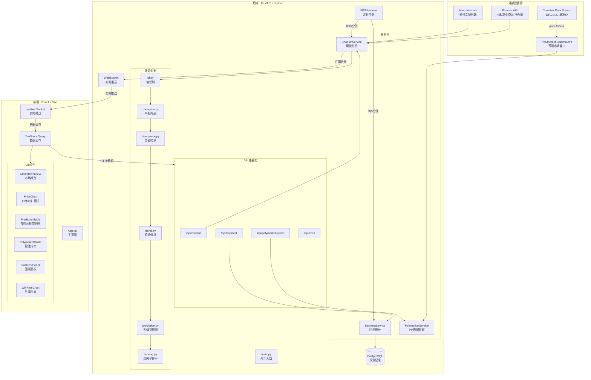
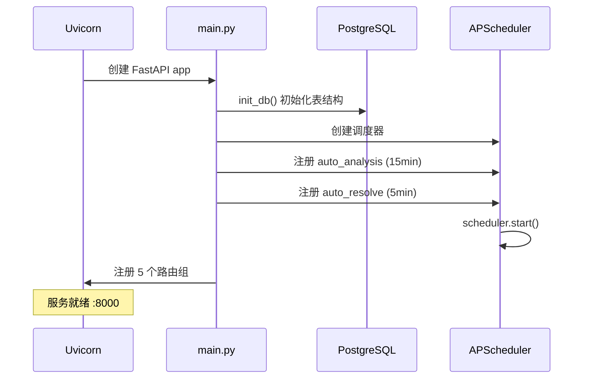
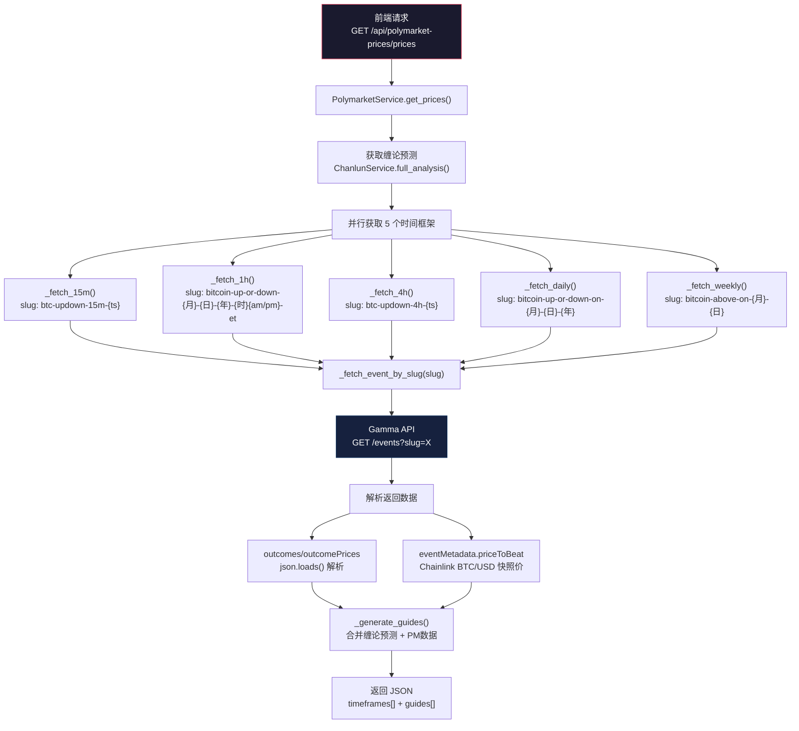
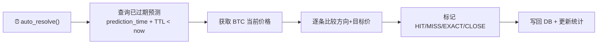
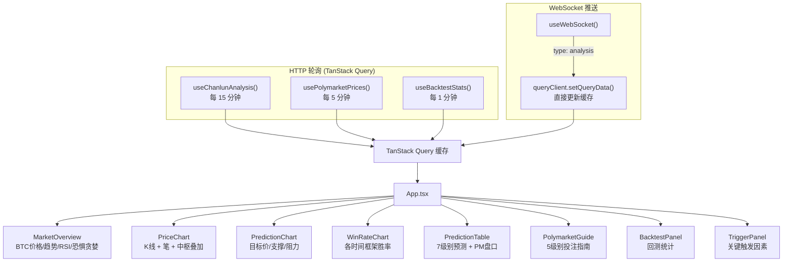
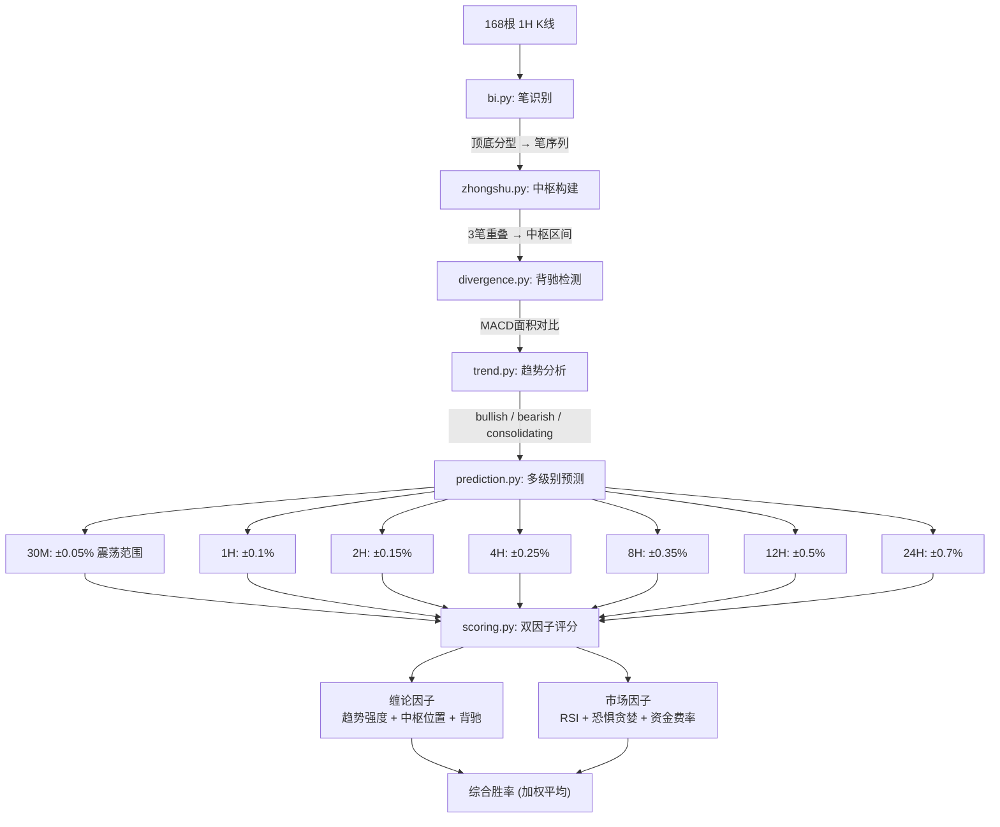

# BTC Chanlun Analyzer — 项目架构与运行流程

## 1. 系统总览



---

## 2. 技术栈

| 层级 | 技术 | 说明 |
|------|------|------|
| **后端框架** | FastAPI + Uvicorn | 异步 Python Web 框架 |
| **定时任务** | APScheduler | 周期性分析 + 自动结算 |
| **实时通信** | WebSocket | 分析结果推送到前端 |
| **数据库** | PostgreSQL + SQLAlchemy | 预测记录持久化 |
| **HTTP客户端** | httpx | 异步外部 API 调用 |
| **前端框架** | React 18 + Vite | SPA 单页应用 |
| **状态管理** | TanStack Query | API 缓存 + 自动轮询 |
| **图表** | Recharts | 价格走势 + 胜率可视化 |
| **样式** | Tailwind CSS | 暗色主题 UI |

---

## 3. 后端运行流程

### 3.1 启动流程



### 3.2 核心分析流程 (每15分钟)

```mermaid
flowchart TD
    A["⏰ APScheduler 触发<br/>auto_analysis()"] --> B["并行获取外部数据"]
    
    B --> B1["Binance: 168根 1H K线"]
    B --> B2["Binance: 资金费率"]
    B --> B3["Alternative.me: 恐惧贪婪"]
    B --> B4["Binance: 持仓量"]
    
    B1 & B2 & B3 & B4 --> C["本地计算技术指标<br/>RSI / MACD / 布林带"]
    
    C --> D["缠论引擎流水线"]
    
    subgraph Engine["缠论引擎 (本地计算)"]
        D --> E1["bi.py → 识别笔 (顶底分型)"]
        E1 --> E2["zhongshu.py → 构建中枢"]
        E2 --> E3["divergence.py → 检测背驰"]
        E3 --> E4["trend.py → 判断趋势"]
        E4 --> E5["prediction.py → 7级别预测<br/>30M/1H/2H/4H/8H/12H/24H"]
        E5 --> E6["scoring.py → 双因子评分<br/>缠论因子 + 市场因子"]
    end
    
    E6 --> F{"有 WS 客户端?"}
    F -->|是| G["广播到所有 WebSocket 客户端"]
    F -->|否| H["跳过广播"]
    
    E6 --> I["保存预测到 PostgreSQL"]
    I --> J["等待下一轮 (15min)"]

    style A fill:#1a1a2e,stroke:#e94560,color:#fff
    style Engine fill:#16213e,stroke:#0f3460
```



### 3.3 Polymarket 数据流



### 3.4 自动结算流程 (每5分钟)



---

## 4. 前端运行流程

### 4.1 数据获取策略



### 4.2 页面布局结构

```
┌─────────────────────────────────────────────────────┐
│  Header: BTC Chanlun Analyzer · POLYMARKET GUIDE    │
├─────────────────────────────────────────────────────┤
│  MarketOverview: 价格 | 趋势 | RSI | 恐惧贪婪 | 费率│
├─────────────────────────────────────────────────────┤
│  PriceChart: K线 + 缠论笔 + 中枢覆盖                │
├───────────────────────┬─────────────────────────────┤
│  PredictionChart      │  WinRateChart               │
│  目标价/支撑/阻力      │  各时间框架胜率柱状图         │
├───────────────────────┴─────────────────────────────┤
│  PredictionTable: 多时间框架预测表                    │
│  时间周期 | 信号 | PM盘口 | PM信号 | 目标价 | 胜率    │
├─────────────────────────────────────────────────────┤
│  PolymarketGuide: Polymarket 投注指南                │
│  开盘基准价 | 当前偏移 | 确定概率 | 缠论胜率 | 市场概率 │
├───────────────────────┬─────────────────────────────┤
│  TriggerPanel         │  BacktestPanel              │
│  关键触发因素          │  回测统计                    │
└───────────────────────┴─────────────────────────────┘
```

---

## 5. API 端点清单

| 端点 | 方法 | 说明 | 轮询间隔 |
|------|------|------|----------|
| `/api/chanlun/analysis` | GET | 完整缠论分析 + 7级别预测 | 15min |
| `/api/chanlun/validate` | GET | 验证上一轮预测准确率 | 15min |
| `/api/backtest/stats` | GET | 回测统计 (胜率/精度) | 1min |
| `/api/backtest/save` | POST | 保存预测批次 | 自动 |
| `/api/backtest/resolve` | POST | 手动结算过期预测 | — |
| `/api/polymarket-prices/prices` | GET | PM盘口 + 投注指南 | 5min |
| `/api/cron/` | GET | 查看定时任务列表 | — |
| `/api/cron/{job_id}/run` | POST | 手动触发定时任务 | — |
| `/api/health` | GET | 健康检查 | — |
| `/ws/analysis` | WS | 实时分析推送 | 持续连接 |

---

## 6. 外部 API 依赖

| API | 用途 | 频率 | 需要密钥 |
|-----|------|------|---------|
| **Binance REST** | K线/资金费率/持仓量 | 每15min | ❌ 公开 |
| **Alternative.me** | 恐惧贪婪指数 | 每15min | ❌ 公开 |
| **Polymarket Gamma** | 预测市场盘口/概率 | 每5min | ❌ 公开 |
| **Chainlink Data Stream** | BTC/USD 基准价 (via Gamma `eventMetadata.priceToBeat`) | 每5min | ❌ 内嵌 |

---

## 7. 数据模型

### prediction 表 (PostgreSQL)

| 字段 | 类型 | 说明 |
|------|------|------|
| id | SERIAL PK | 自增主键 |
| timeframe | VARCHAR | 时间级别 (30M/1H/...) |
| direction | VARCHAR | 预测方向 (up/down/sideways) |
| target_price | FLOAT | 目标价格 |
| current_price | FLOAT | 当时价格 |
| actual_price | FLOAT | 到期实际价格 |
| prediction_time | TIMESTAMP | 预测时间 |
| resolved_at | TIMESTAMP | 结算时间 |
| direction_correct | BOOLEAN | 方向是否正确 |
| accuracy_grade | VARCHAR | EXACT/CLOSE/HIT/MISS |
| error_pct | FLOAT | 误差百分比 |

---

## 8. 缠论引擎详解



---

## 9. 关键目录结构

```
project/
├── backend/                    # Python 后端
│   ├── app/
│   │   ├── main.py            # 应用入口 + 生命周期
│   │   ├── config.py          # Pydantic Settings
│   │   ├── api/               # 路由层
│   │   │   ├── chanlun.py     #   缠论分析接口
│   │   │   ├── backtest.py    #   回测接口
│   │   │   ├── polymarket.py  #   PM价格接口
│   │   │   ├── cron.py        #   定时任务管理
│   │   │   └── ws.py          #   WebSocket 实时推送
│   │   ├── services/          # 业务逻辑层
│   │   │   ├── chanlun_service.py    # 缠论分析编排
│   │   │   ├── backtest_service.py   # 回测统计
│   │   │   └── polymarket_service.py # PM数据处理
│   │   ├── engines/           # 缠论计算引擎
│   │   │   ├── bi.py          #   笔识别
│   │   │   ├── zhongshu.py    #   中枢构建
│   │   │   ├── divergence.py  #   背驰检测
│   │   │   ├── trend.py       #   趋势分析
│   │   │   ├── prediction.py  #   多级别预测
│   │   │   └── scoring.py     #   综合评分
│   │   ├── clients/           # 外部API客户端
│   │   │   ├── binance_client.py     # Binance
│   │   │   ├── market_client.py      # 恐惧贪婪
│   │   │   └── polymarket_client.py  # Gamma API
│   │   └── models/            # 数据模型
│   │       ├── base.py        #   DB连接+会话
│   │       └── prediction.py  #   Prediction ORM
│   └── .env                   # 环境变量
│
├── frontend/                   # React 前端
│   ├── src/
│   │   ├── App.tsx            # 主页面布局
│   │   ├── components/        # UI 组件
│   │   │   ├── MarketOverview.tsx     # 市场概览
│   │   │   ├── PriceChart.tsx         # K线+缠论叠加
│   │   │   ├── PredictionChart.tsx    # 目标价投影
│   │   │   ├── WinRateChart.tsx       # 胜率柱状图
│   │   │   ├── PredictionTable.tsx    # 多TF预测表
│   │   │   ├── PolymarketGuide.tsx    # PM投注指南
│   │   │   ├── PolymarketPanel.tsx    # PM盘口展示
│   │   │   ├── BacktestPanel.tsx      # 回测统计面板
│   │   │   ├── TriggerPanel.tsx       # 触发因素
│   │   │   └── ValidationPanel.tsx    # 验证面板
│   │   ├── hooks/
│   │   │   └── useWebSocket.ts # WS实时推送Hook
│   │   └── lib/
│   │       ├── chanlun.ts     # API调用+React Query
│   │       ├── api.ts         # 基础HTTP封装
│   │       └── fetch.ts       # Fetch工具
│   └── index.html
│
└── docs/                       # 文档
```

---

## 10. 运行命令

```bash
# 后端
cd backend
pip install -r requirements.txt
cp .env.example .env            # 配置 DATABASE_URL
python -m uvicorn app.main:app --host 0.0.0.0 --port 8000

# 前端
cd frontend
npm install
npx vite --port 5173
```

**访问**: `http://localhost:5173`
