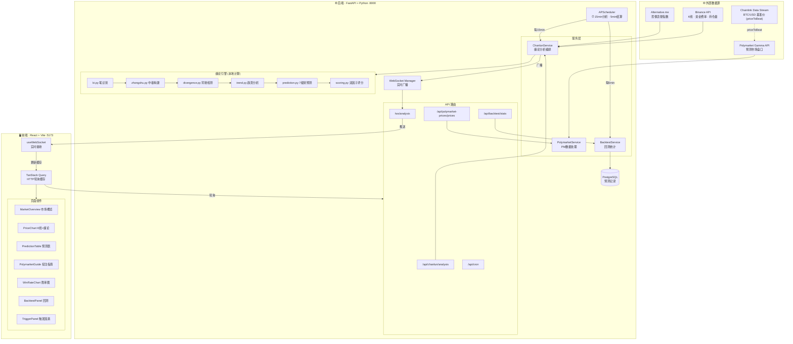
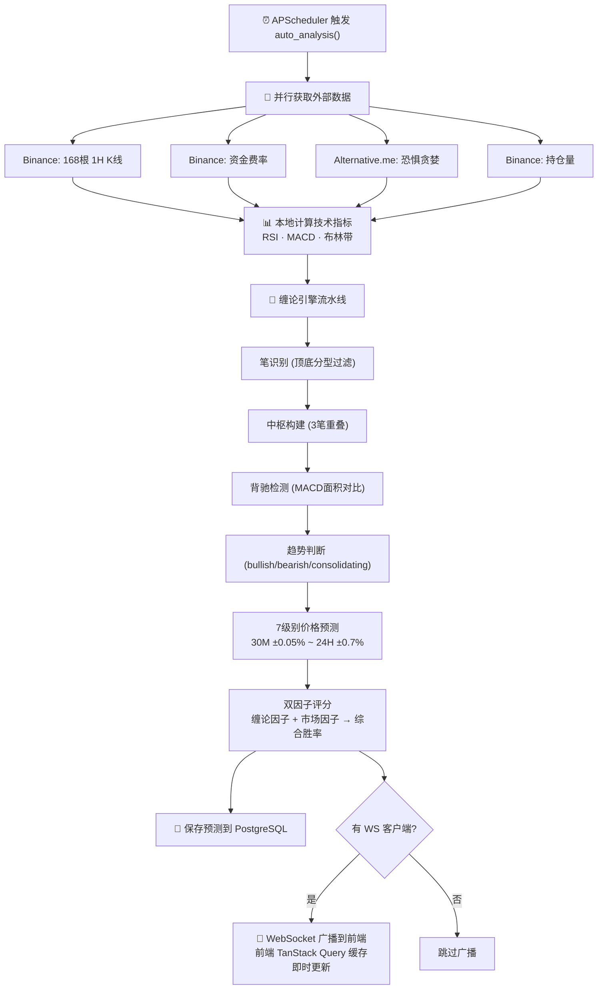
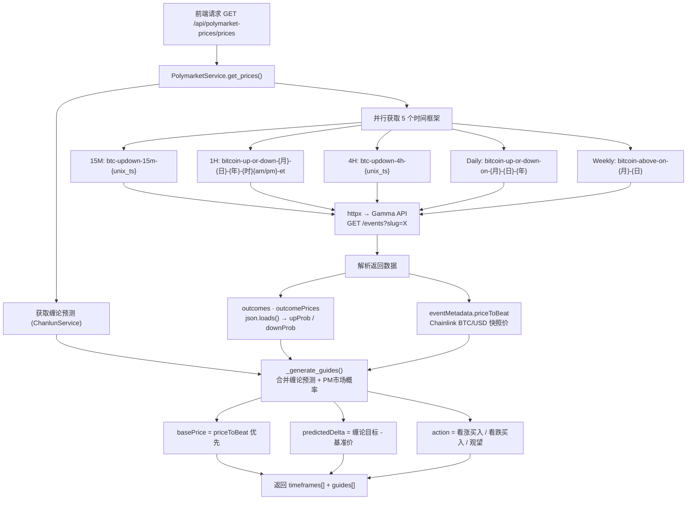
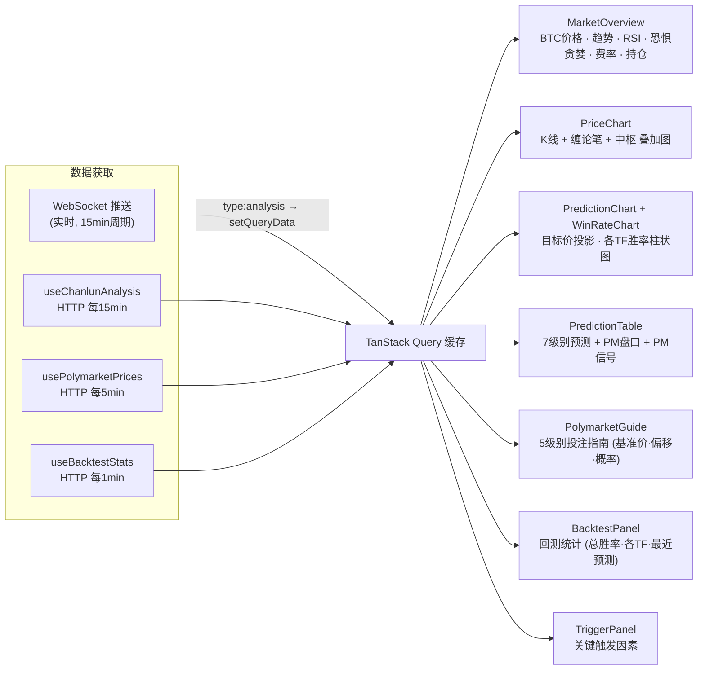
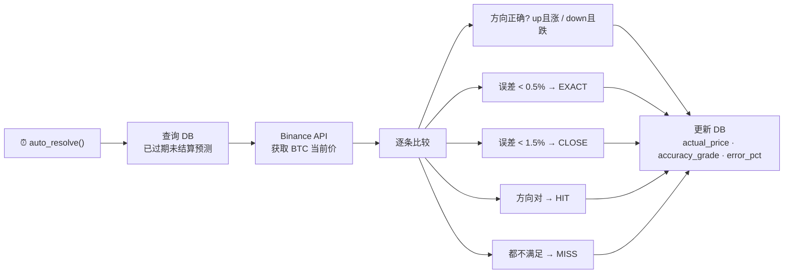

# BTC Chanlun Analyzer — 项目架构导图

## 1. 系统架构总览



---

## 2. 核心分析流程 (每15分钟自动执行)



---

## 3. Polymarket 数据流 (每5分钟轮询)



---

## 4. 前端数据获取与组件映射



---

## 5. 自动结算流程 (每5分钟)



---

## 6. 页面布局

```
┌─────────────────────────────────────────────────────────────┐
│  Header: BTC Chanlun Analyzer · POLYMARKET BETTING GUIDE    │
├─────────────────────────────────────────────────────────────┤
│  MarketOverview: 价格 │ 趋势 │ RSI │ 恐惧贪婪 │ 费率 │ 持仓  │
├─────────────────────────────────────────────────────────────┤
│  PriceChart: K线 + 缠论笔 + 中枢区间 覆盖                    │
├────────────────────────────┬────────────────────────────────┤
│  PredictionChart           │  WinRateChart                  │
│  目标价 · 支撑 · 阻力       │  30M~24H 各级别胜率             │
├────────────────────────────┴────────────────────────────────┤
│  PredictionTable: 多时间框架预测                              │
│  时间周期 │ 信号 │ PM盘口 │ PM信号 │ 目标价 │ 涨跌幅 │ 胜率    │
├─────────────────────────────────────────────────────────────┤
│  PolymarketGuide: Polymarket 投注指南                        │
│  开盘基准价 │ 当前偏移 │ 确定概率 │ 缠论胜率 │ 市场概率         │
├────────────────────────────┬────────────────────────────────┤
│  TriggerPanel              │  BacktestPanel                 │
│  关键触发因素               │  回测统计 (胜率/精度/趋势)       │
└────────────────────────────┴────────────────────────────────┘
```
